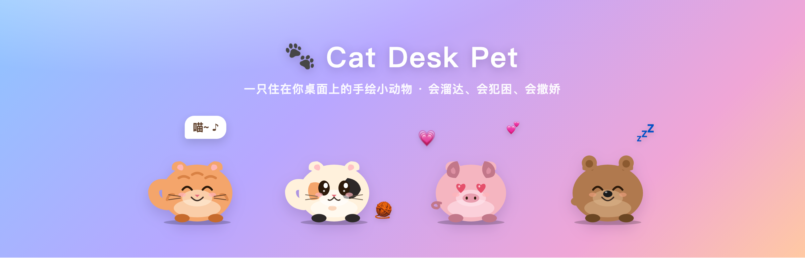

<div align="center">



# 🐾 摸鱼猫

**简体中文** · [English](README.en.md)

**一只住在你桌面上的手绘小动物。**  
原生小窗 · Rust 状态机 · 离线分层图集 · **无 WebView**

[⬇️ 下载](#-下载) · [🛠 构建](#-从源码构建)

</div>

---

> 本仓库是 **v2 原生实现**。旧版全屏 WebView / Tauri 在 [`vvphp/desktop-cat`](https://github.com/vvphp/desktop-cat)（已归档对照，不再作为默认路径）。

## ⬇️ 下载

去 **[Releases](../../releases)** 下载：

| 平台 | 文件 |
|---|---|
| macOS | `摸鱼猫.dmg`（通用包） |
| Windows | `cat-desk-pet.exe` |

未签名属正常：macOS 右键打开；Windows SmartScreen → Run anyway。  
无 Dock / 任务栏图标；**右键宠物**或点菜单栏托盘可操作。真正退出用托盘「退出」。

## 🛠 从源码构建

需要 [Rust](https://rustup.rs)。

```bash
git clone https://github.com/vvphp/cat-desk-pet
cd cat-desk-pet
cargo run --release          # 或 npm run dev
./tools/run-pet.sh           # 后台脱离终端
./tools/package-macos.sh     # → dist/macos/摸鱼猫.app + .dmg

# 实验性 wgpu A/B（不改变默认 native 后端）
cargo run --release --features renderer-wgpu -- --renderer wgpu --mode walking
```

打 tag 发版：`git tag v1.0.0 && git push origin v1.0.0`（见 `.github/workflows/release.yml`）。

## 架构摘要

```
托盘 / 右键菜单
      │
      ▼
 ~180×180 置顶透明小窗（跟宠）
      │
      ▼
 分层图集（由 assets/pet.svg 离线生成）→ NativeRenderer → CALayer / softbuffer
      ▲
      │
 Rust 行为状态机（src/pet/）
```

- macOS：自管 CALayer 透明提交（绕过 softbuffer 丢 alpha）
- 普通运行不解析 SVG；显式资产编译命令见 [`docs/renderer-assets.md`](docs/renderer-assets.md)
- 可切换的 wgpu 实验后端、直绘/回退边界见 [`docs/renderer-wgpu.md`](docs/renderer-wgpu.md)
- 姿态缓存 LRU 限流，避免走路把内存撑爆
- CPU / Phase 记录见 [`docs/perf.md`](docs/perf.md)

## License

MIT
